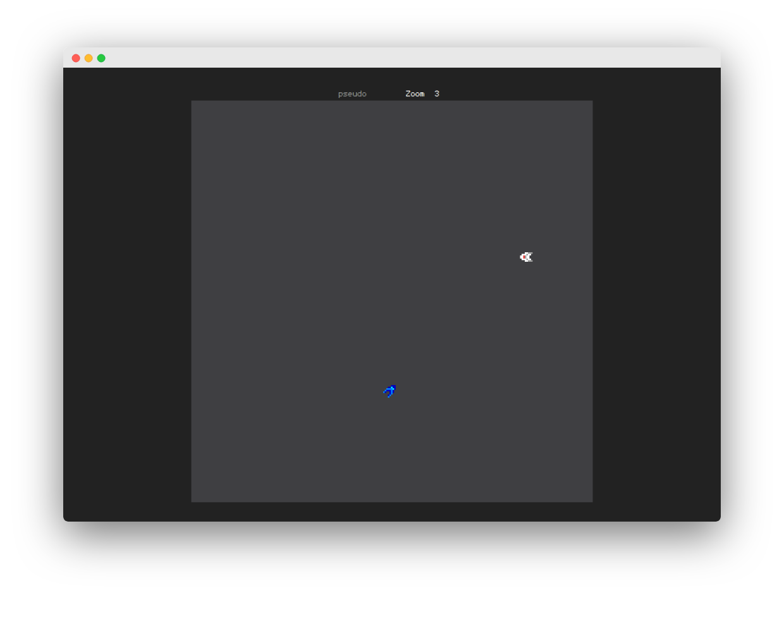

#  Kotosu 

[](https://github.com/ellerbrock/open-source-badges/)
[](https://github.com/ellerbrock/typescript-badges/)




## Summary

1. [Introduction](#Introduction)    
2. [Command](#Command)  
    2.1 [Tool](#Tool)  
    2.2 [Install](#Install)  
3. [Keyboard](#Keyboard)
4. [Next step](#Next-step)

---

## Introduction

Kotosu is mini-game whith space ship 🚀.  
Stay simple for the moment 😜.
`This project is open source`. 

## Command

### Tool

**`start`** the server. URL : `http://localhost:3000`
```bash
npm start
```

**`watch`** is best command for game developer because the code is auto compile when save.
```bash
npm run watch
```

**`cdebug`** is useful to see the bug but also where to get latency. URL : `chrome://inspect/#devices`
```bash
npm run debug
```

**`build`** is convenient for just build
```bash
npm run build
```

**`kill`** just works for the linux system. It allows to remove the prossesus from the server in case of bug
```bash
npm run kill
```

### Install

Allows to **`install`** all dependencies
```bash
npm install
```

```bash
npx webpack --config webpack.config.js
npm install -D ts-loader   
```

## Keyboard

| Keyboard    | Action                 | Code | Vector X | Vector Y |
|:----------- |:----------------------:| ----:| --------:| --------:|
| ArrowUp     |       Move up    ⬆️     |  38  |     0    |    1     |
| ArrowDown   |       Move down  ⬇️     |  40  |     0    |   -1     |
| Arrow       |       Move left  ⬅️     |  37  |    -1   |     0    |
| ArrowRight  |       Move right ➡️     |  38  |    1    |    0     |
|             |                         |      |          |         |
|             |                         |      |          |         |
| W           |       Shoot      ☄️     |  87  |     ∅   |     ∅   |
| X           |       Dash       ⚡      |  88  |    ∅    |   ∅     |
|             |                         |      |          |         |
|             |                         |      |          |         |
| Up-Left     |         ⬅️ ⬆️            |   ∅  |     -1   |   1     |
| Up-Right    |         ⬆️  ➡️           |   ∅   |    1    |   1     |
| Down-Left   |         ⬅️ ⬇️            |   ∅   |    -1   |   -1    |
| Down-Right  |         ⬇️  ➡️           |  ∅    |     1   |   -1    |    

**Direction**

| ∅ |-1 | 0 | 1 | X |
|:-:|:-:|:-:|:-:|:-:|
| 1 | ↖️| ⬆️ | ↗️|   ️|
| 0 | ⬅️| 0  | ➡️|   |   ️
|-1 | ↙️| ⬇️ | ↘️ |   ️|
| Y |   |   |   |   ️|


## Next step

- Start game ( annimation )
- Login
    - Display
    - Detect all keyboard
- Menu  
    - Play
    - Settings
    - About
- Create different type game play
    - Add object
    - Race
    - Battle Royle